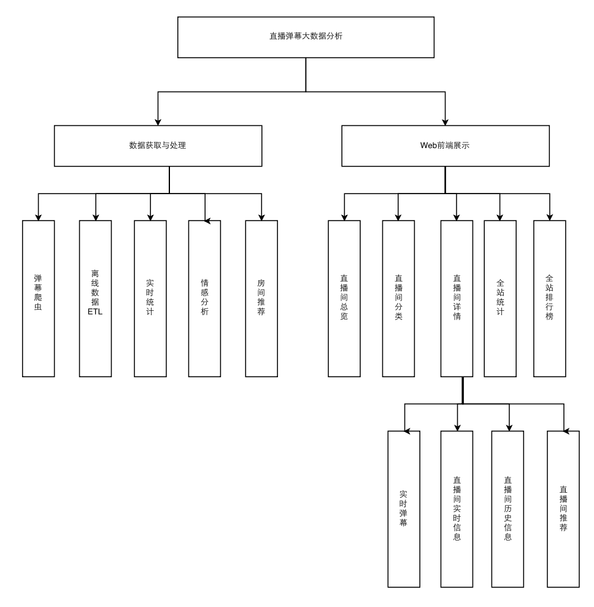
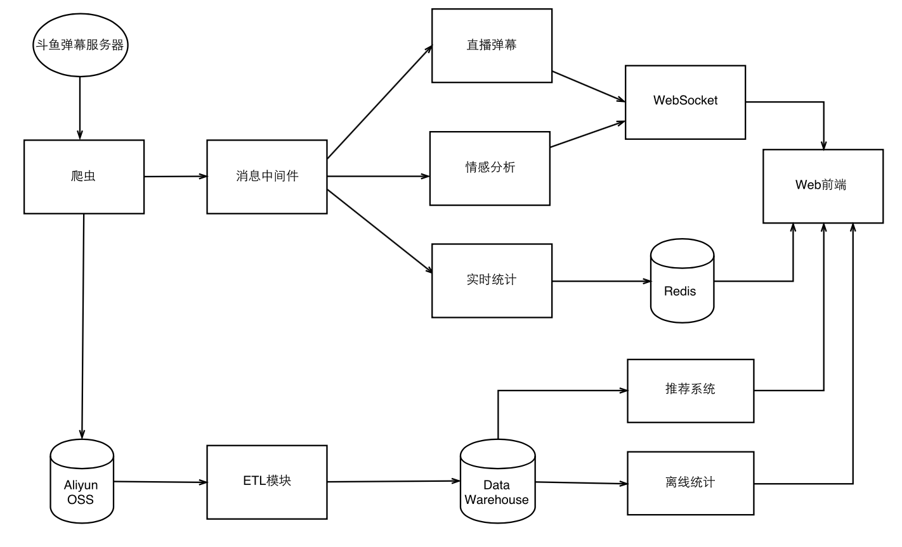
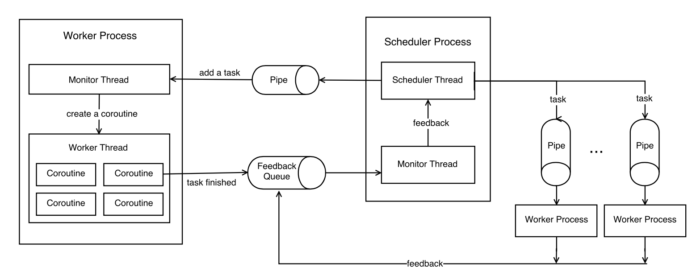
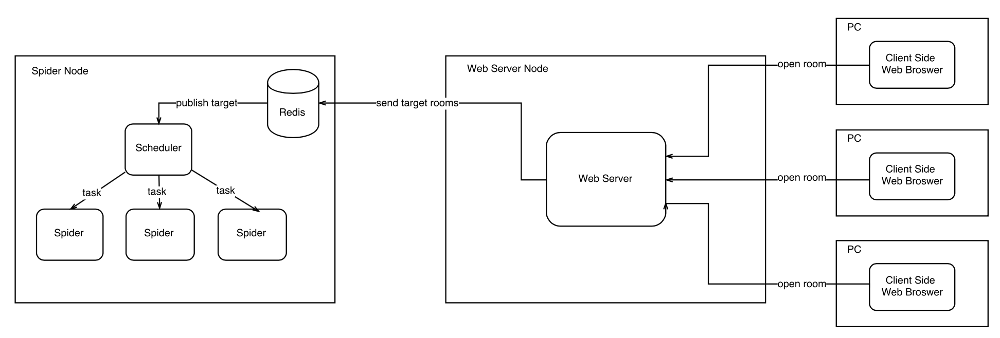
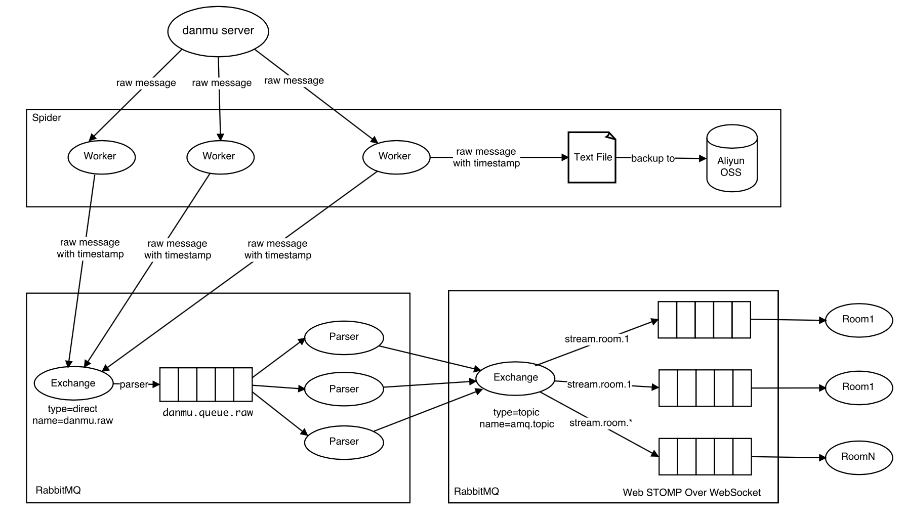
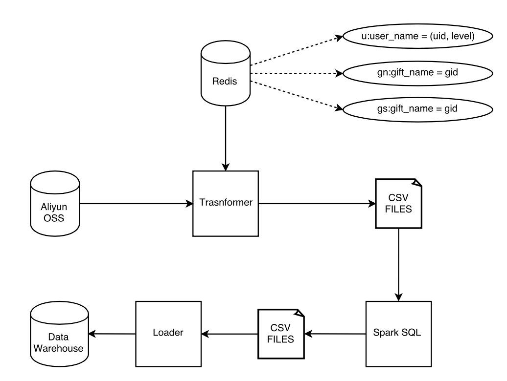

# 斗鱼弹幕分析

- **直播间总览页面**：显示正在直播的直播间
- **直播间分类页面**：展示所有的直播间分类，进入指定分类后，会显示该分类下的所有直播间
- **弹幕可视化页面**：实时显示所在直播间的弹幕，弹幕经过情感分析之后会用不同的颜色标明，以区分不同的情感
- **直播间实时信息**：以可视化的图标来展示直播间的实时状态，包括用户数、实时收入以及推荐的相关直播间等信息
- **直播间历史信息**：展示直播间历史数据的统计图
- **全站排行榜**：展示依据各种不同维度的排行榜全站统计页面，根据全站的历史信息，展示各维度的历史统计图

## 模块

- [danmu](danmu) 弹幕爬虫
- [etl](etl) ETL
- [live](live) 实时处理
- [metaspider](metaspider) 直播间元信息
- [site](site) Web

## 设计

### 功能

### 数据流

### 爬虫

### 实时消息

### ETL

